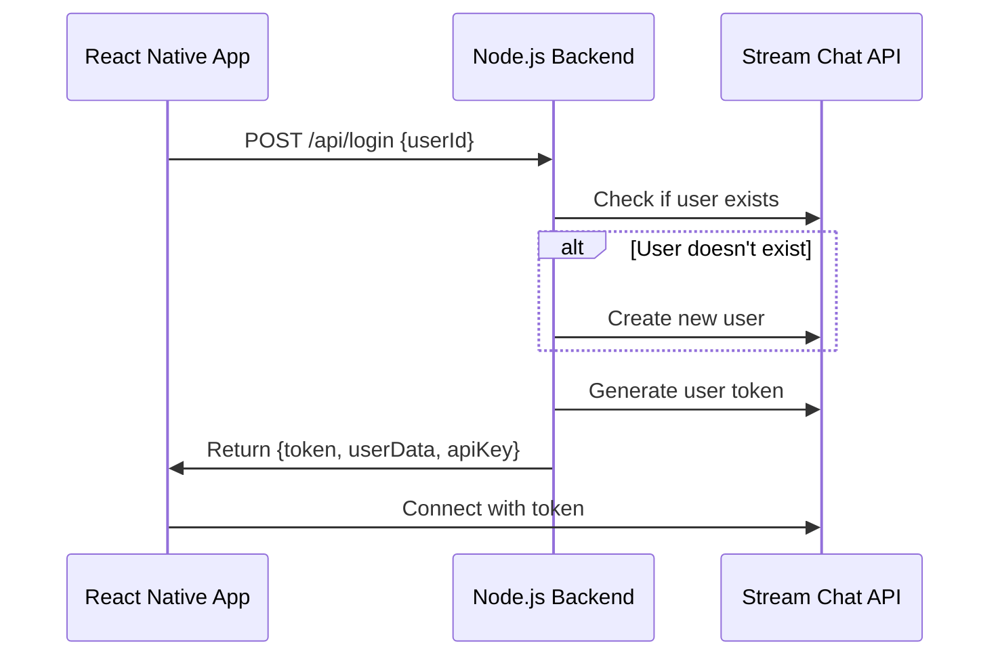

# Slack Clone - React Native Chat Application

A feature-rich Slack-inspired chat application built with React Native and powered by Stream Chat API. This project demonstrates modern React Native development practices, real-time messaging capabilities, and seamless integration with Stream's chat infrastructure.

## 🚀 Project Overview

This Slack Clone is a comprehensive messaging application that replicates core Slack functionalities including real-time messaging, channel management, direct messages, threading, reactions, and more. Built with React Native for cross-platform compatibility and Stream Chat for robust messaging infrastructure.

### 🏗️ Architecture

```
SlackClone/
├── 📱 React Native Frontend (iOS/Android)
├── 🌐 Node.js Backend (Express + Stream Chat)
├── ☁️ Stream Chat API Integration
├── 📦 Fastlane CI/CD Pipeline
└── 🔧 Development Tools & Configuration
```

## ✨ Key Features

### 🔐 Authentication & User Management
- **Simple Authentication System**: Custom login with Stream Chat integration
- **Persistent Login**: Auto-login with stored credentials
- **User Profile Management**: Profile pictures, status, and user data
- **Secure Token Management**: JWT-based authentication with Stream Chat

### 💬 Messaging Features
- **Real-time Messaging**: Instant message delivery and updates
- **Channel Management**: Create, join, and manage channels
- **Direct Messages**: One-on-one private conversations
- **Message Threading**: Reply to messages in organized threads
- **Message Reactions**: React to messages with emojis
- **File Sharing**: Share images, documents, and media files
- **Message Search**: Search across messages and channels
- **Mentions System**: @mention users and channels
- **Typing Indicators**: See when others are typing
- **Read Receipts**: Track message read status
- **Message Actions**: Edit, delete, and react to messages

### 🎨 User Interface
- **Slack-inspired Design**: Familiar and intuitive interface
- **Dark/Light Theme Support**: Automatic theme switching
- **Custom Components**: Reusable UI components for consistency
- **Responsive Design**: Optimized for various screen sizes
- **Bottom Tab Navigation**: Easy navigation between sections
- **Modal Screens**: Clean presentation of detailed views
- **Smooth Animations**: React Native Reanimated for fluid UX

### 🔍 Advanced Features
- **Message Search**: Full-text search across conversations
- **Channel Search**: Find and join new channels
- **User Search**: Discover and connect with team members
- **Jump to Message**: Quick navigation to specific messages
- **Unread Indicators**: Visual indicators for unread content
- **Presence Status**: Online/offline user status
- **Custom Keyboards**: Enhanced input experience
- **Image Gallery**: View and share images seamlessly

## 🛠️ Technology Stack

### Frontend (React Native)
```json
{
  "core": {
    "react": "18.1.0",
    "react-native": "0.70.6"
  },
  "navigation": {
    "@react-navigation/native": "^5.9.4",
    "@react-navigation/stack": "^5.14.5",
    "@react-navigation/bottom-tabs": "^5.11.11",
    "@react-navigation/drawer": "^5.12.5"
  },
  "chat": {
    "stream-chat-react-native": "5.5.1"
  },
  "ui_libraries": {
    "react-native-reanimated": "2.13.0",
    "react-native-gesture-handler": "^2.8.0",
    "react-native-svg": "^12.1.1",
    "@react-native-community/blur": "^4.3.0"
  },
  "media_handling": {
    "react-native-image-crop-picker": "^0.36.2",
    "@react-native-camera-roll/camera-roll": "^5.0.1",
    "react-native-document-picker": "^8.1.2"
  }
}
```

### Backend (Node.js)
```json
{
  "runtime": "Node.js",
  "framework": "Express.js",
  "chat_api": "Stream Chat Server SDK",
  "dependencies": {
    "express": "^4.18.2",
    "stream-chat": "^8.12.0",
    "cors": "^2.8.5",
    "dotenv": "^16.3.1"
  }
}
```

## 🌊 Stream Chat Integration

### Stream App Configuration
- 
- **Environment**: Connected to custom Stream Chat application
- **Features Enabled**:
  - Real-time messaging
  - Channel management
  - User presence
  - Message reactions
  - File uploads
  - Push notifications
  - Typing indicators
  - Read receipts

### Stream Chat Features Utilized
1. **Chat Client**: Singleton pattern for optimal performance
2. **Channel Lists**: Paginated channel discovery
3. **Message Lists**: Infinite scroll with message caching
4. **User Management**: Automatic user creation and management
5. **Permissions**: Role-based channel access
6. **Reactions**: Custom emoji reaction system
7. **Threads**: Nested message conversations
8. **Search**: Server-side message and channel search

### Stream SDK Integration Points
```javascript
// Chat Client Setup
const chatClient = StreamChat.getInstance(apiKey, {
  timeout: 10000,
});

// User Connection
await chatClient.connectUser(
  {
    id: userId,
    name: userName,
    image: userImage,
  },
  userToken
);

// Channel Management
const channel = chatClient.channel('messaging', channelId, {
  name: channelName,
  members: [userId],
});
```

## 🔧 Backend API Architecture

### Server Structure (`slack-clone-backend/`)
```
slack-clone-backend/
├── server.js              # Main Express server
├── package.json           # Dependencies and scripts
└── README.md              # Backend documentation
```

### API Endpoints

#### Authentication
- **POST** `/api/login`
  - Authenticates user with Stream Chat
  - Creates user if doesn't exist
  - Returns Stream token and user data
  
#### Health Check
- **GET** `/api/health`
  - Server status verification
  - Stream API connectivity check

#### Root
- **GET** `/`
  - API documentation and endpoint listing

### Backend Features
1. **User Auto-Creation**: Automatically creates Stream Chat users
2. **Token Generation**: Secure JWT token creation for Stream Chat
3. **Error Handling**: Comprehensive error responses
4. **CORS Support**: Cross-origin request handling
5. **Environment Configuration**: Secure API key management

### Authentication Flow


## 🚀 Deployment & CI/CD

### Fastlane Configuration
The project includes a comprehensive Fastlane setup for automated deployments:

#### iOS Deployment
- **TestFlight Distribution**: Automated beta releases
- **App Store Deployment**: Production releases
- **Certificate Management**: Automatic provisioning profiles
- **Code Signing**: Match-based certificate handling

#### Fastlane Lanes
```ruby
# Deploy to TestFlight
fastlane ios deploy_to_testflight

# Certificate management
fastlane match_appstore
fastlane match_me
```

### Environment Configuration
- **Development**: Local development with tunneling (localtunnel)
- **Staging**: Backend deployed with environment variables
- **Production**: Secure deployment with environment separation

### Backend Deployment
- **Tunnel URL**: `https://rotten-wombats-nail.loca.lt`
- **Port**: 3001 (configurable via environment)
- **Health Monitoring**: Built-in health check endpoints

## 📱 Development Setup

### Prerequisites
- Node.js (v14+)
- React Native CLI
- iOS: Xcode and CocoaPods
- Android: Android Studio and SDK
- Stream Chat account

### Installation

1. **Clone Repository**
```bash
git clone <repository-url>
cd SlackClone
```

2. **Install Dependencies**
```bash
# Frontend dependencies
yarn install

# iOS dependencies (macOS only)
cd ios && pod install && cd ..

# Backend dependencies
cd slack-clone-backend
npm install
cd ..
```

3. **Environment Setup**
```bash
# Frontend (.env)
API_KEY=your_stream_api_key
USER_ID=your_user_id
USER_TOKEN=your_generated_token

# Backend (.env)
STREAM_API_KEY=your_stream_api_key
STREAM_API_SECRET=your_stream_api_secret
PORT=3001
```

4. **Start Development Servers**
```bash
# Start backend server
cd slack-clone-backend
npm run dev

# Start React Native Metro bundler
cd ..
yarn start

# Run on device/simulator
yarn android  # for Android

```

### Development Tools
- **Metro Bundler**: React Native JavaScript bundler
- **Flipper**: React Native debugging platform
- **React DevTools**: Component debugging
- **Stream Chat CLI**: Stream Chat development tools

## 🏗️ Project Structure

### Frontend Architecture
```
src/
├── components/           # Reusable UI components
│   ├── InputBox/        # Message input component
│   ├── MessageAction/   # Message action menus
│   ├── SlackChannelListItem/ # Channel list items
│   └── ...              # Other UI components
├── contexts/            # React contexts
│   └── SlackAppContext.js
├── hooks/              # Custom React hooks
│   ├── useStreamChatTheme.js
│   ├── useSlackChannels.js
│   └── ...             # Other utility hooks
├── screens/            # Screen components
│   ├── ScreenChannelList/
│   ├── ScreenChannel/
│   ├── MessageSearchScreen/
│   └── ...             # Other screens
├── services/           # API services
│   └── simpleAuthService.js
├── utils/              # Utility functions
│   ├── ChatClientStore.js
│   └── AsyncStore.js
└── styles/             # Styling configurations
```

### Component Hierarchy
```
App
├── NavigationContainer
│   ├── BottomTabNavigator
│   │   ├── ChannelListScreen
│   │   ├── DirectMessagesScreen
│   │   ├── MentionsScreen
│   │   └── ProfileScreen
│   └── StackNavigator
│       ├── ChannelScreen
│       ├── ThreadScreen
│       ├── MessageSearchScreen
│       └── NewMessageScreen
└── OverlayProvider (Stream Chat)
```

## 🎨 UI/UX Design

### Theme System
- **Light Theme**: Clean, professional appearance
- **Dark Theme**: Eye-friendly dark mode
- **Automatic Switching**: System preference detection
- **Custom Color Palette**: Slack-inspired color scheme

### Component Design Principles
1. **Consistency**: Uniform design language across screens
2. **Accessibility**: Screen reader support and proper contrast
3. **Performance**: Optimized rendering and memory usage
4. **Responsiveness**: Adaptive layouts for different screen sizes

### Key UI Components
- **Channel List**: Scrollable list with unread indicators
- **Message List**: Infinite scroll with virtualization
- **Input Box**: Rich text input with media attachment
- **Reaction Picker**: Emoji selection interface
- **Thread View**: Nested conversation display

## 🔒 Security Features

### Authentication Security
- **JWT Tokens**: Secure authentication with Stream Chat
- **Token Refresh**: Automatic token renewal
- **Secure Storage**: Encrypted local storage for credentials

### Data Security
- **API Validation**: Input validation on all endpoints
- **CORS Protection**: Controlled cross-origin requests
- **Rate Limiting**: Protection against abuse
- **Environment Variables**: Secure API key management

## 📊 Performance Optimizations

### React Native Optimizations
- **FlatList Optimization**: Efficient list rendering
- **Image Caching**: Optimized image loading
- **Bundle Splitting**: Reduced initial load time
- **Memory Management**: Proper component cleanup

### Stream Chat Optimizations
- **Connection Pooling**: Efficient WebSocket management
- **Message Caching**: Local message storage
- **Pagination**: Efficient data loading
- **Background Sync**: Offline message handling


## 📚 API Documentation

### Stream Chat API Integration
The application leverages Stream Chat's comprehensive API:

- **Channels API**: Channel CRUD operations
- **Messages API**: Message sending, editing, deletion
- **Users API**: User management and presence
- **Reactions API**: Message reaction handling
- **Search API**: Message and channel search
- **Moderation API**: Content moderation features

### Custom Backend Endpoints
- **User Authentication**: Simplified login flow
- **Token Management**: Secure token generation
- **Health Monitoring**: System status checks

## 🔮 Future Enhancements

### Planned Features
1. **Voice Messages**: Audio message recording and playback
2. **Video Calls**: Integrated video calling functionality
3. **Screen Sharing**: Share screen during conversations
4. **Custom Emojis**: Upload and use custom emoji reactions
5. **Message Scheduling**: Schedule messages for later delivery
6. **Advanced Moderation**: Content filtering and user management
7. **Analytics Dashboard**: Usage statistics and insights
8. **Multi-workspace Support**: Support for multiple team workspaces

### Technical Improvements
1. **Push Notifications**: Real-time notification system
2. **Offline Support**: Enhanced offline message handling
3. **Database Integration**: Local SQLite for offline data
4. **Performance Monitoring**: Application performance tracking
5. **Automated Testing**: Comprehensive test coverage
6. **Documentation**: Interactive API documentation

## 🤝 Contributing

### Development Guidelines
1. Follow React Native best practices
2. Maintain consistent code formatting
3. Write comprehensive tests
4. Update documentation for new features
5. Follow Stream Chat integration patterns


## 📄 License

This project is licensed under the MIT License - see the LICENSE file for details.


---

**Built with ❤️ using React Native and Stream Chat**

*This Slack Clone demonstrates the power of modern React Native development combined with Stream Chat's robust messaging infrastructure, creating a production-ready chat application with enterprise-grade features.*
